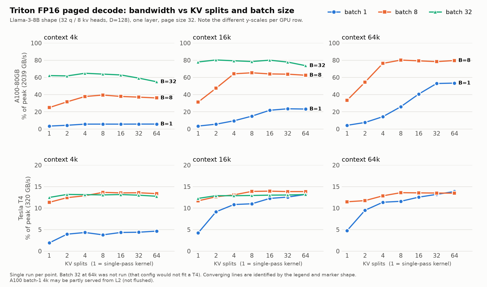

# bytes-per-token (`bpt`)

Quantized, paged-KV decode attention kernels in Triton and CUDA.

LLM decode is memory-bandwidth-bound: each step reads the whole KV cache to produce one token. This project asks whether shrinking the cache (FP16 -> INT8/FP8 -> INT4) turns into a real decode speedup at long context, without hurting accuracy. The metric that matters is achieved bandwidth against hardware peak.

**Target:** GQA decode (one query token per sequence), Llama-3-8B shape (32 q heads, 8 KV heads, head_dim 128), paged KV cache with a block table, context 4k-128k, batch 1-64. Keys are quantized per channel and values per token (KIVI-style), with dequantization fused into the kernel.

## Status

| # | Milestone | State |
|---|---|---|
| 1 | PyTorch reference + roofline script | done |
| 2 | Triton FP16 paged-KV kernel | done |
| 3 | Split-KV (split the sequence, merge partial softmaxes) | done; ~80% of A100 peak at batch >= 8 |
| 4 | Quantized KV (INT8/FP8, then INT4), fused dequant | not started |
| 5 | CUDA port of the hot path | not started |
| 6 | Benchmark vs FlashInfer / vLLM; vLLM/HF backend | not started |

**Current performance (Triton FP16 with split-KV, one layer, Llama-3-8B shape, single run each):**

| GPU | Batch / context | Achieved | % of peak |
|---|---|---|---|
| A100-80GB | 8-32 / 16k-64k | 1.6 TB/s | ~78-80% |
| A100-80GB | 1 / 64k | 1.09 TB/s | ~53% |
| A100-80GB | 1 / 4k-16k | 0.12-0.48 TB/s | 6-24% |
| T4 | any | 40-46 GB/s | 13-15% |



Split-KV is what makes batch 1 usable (A100, 64k context: 88 -> 1089 GB/s). The T4 numbers are far below the A100's percentages with identical code, so the T4 is used for correctness only and not for tuning. Small-batch, short-context cases are still weak. No speedup over any other implementation (FlashInfer, vLLM) has been measured, and the A100 short-context rows can be partly served from L2. Details, hypotheses and failed attempts are in [docs/NOTES.md](docs/NOTES.md); raw numbers are in `results/`.

## Layout

```
src/bpt/
  reference.py     PyTorch reference (fp32 math) and a paged-cache builder for tests
  roofline.py      bytes-per-token and bandwidth-floor math, GPU peak table
  triton_fp16.py   Triton FP16 paged decode kernel
tests/             pytest correctness tests
bench/             benchmark and roofline CLI scripts
modal_scripts/     Modal launch scripts (GPU runs)
results/           benchmark output (*.json)
docs/NOTES.md      design choices, results, failed attempts
docs/img/          plots (regenerate: python bench/plot_splitkv.py, needs `pip install -e '.[plot]'`)
```

The KV cache uses the vLLM-style layout: `k_cache`/`v_cache` are `[num_blocks, block_size, Hkv, D]`, `block_table` is `[B, max_blocks]` int32, and `seq_lens` is `[B]` int32.

## Setup

```bash
python -m venv .venv && source .venv/bin/activate
pip install -e '.[dev]'
```

## Usage

**Reference tests (CPU is fine):**
```bash
pytest -q
```
The Triton tests need CUDA and are skipped without it.

**Roofline: KV bytes read per decode step and the minimum time on T4 / A100 / H100 / B200:**
```bash
python bench/roofline.py --model llama3-8b --ctx 32768 --batch 8 --kv-dtype int4
```
It counts KV-cache reads only (no weights, q, or output). For quantized dtypes it includes fp16 scale and zero-point overhead. Peak bandwidths are spec-sheet values; achievable is typically 80-90%.

**GPU runs on Modal** (needs a Modal account with billing enabled). Run from outside the repo root or with a working directory other than one containing a `modal/` folder, since a local `modal/` directory shadows the SDK:
```bash
cd /tmp
python -m modal run /path/to/repo/modal_scripts/run_remote.py --gpu T4 \
    --cmd "python -m pytest -q -s tests/test_triton_fp16.py"
python -m modal run /path/to/repo/modal_scripts/run_remote.py --gpu T4 \
    --cmd "python bench/bench_triton_fp16.py" --save triton_fp16_T4
python -m modal run /path/to/repo/modal_scripts/gpu_smoke.py --gpu T4
```
`--gpu` accepts `T4`, `A100-80GB`, `H100`, `B200`. `T4` and `A100-80GB` have been run; `H100` and `B200` have not. Keep runs short; the functions use `max_containers=1` and a short `scaledown_window`.

## Ground rules

- Every kernel must pass a correctness test against the PyTorch reference (max abs/rel error reported) before moving on.
- No speedup claim without a benchmark: warmup, multiple iterations, CUDA events, fixed seeds, results in `results/*.json`, reported as achieved GB/s and % of peak.
- Quantization accuracy (perplexity, needle-in-a-haystack) is checked separately from speed.
- Dev/correctness on a T4 (sm75: FP16 only, no bf16/FP8/cp.async); tuning and benchmarks on A100/H100/B200.
